

  

  

  

  <h3 id="currentCityContainer">Felix is currently in <b id="currentCityB" class="highlighted"></b></h3>
  <h3 id="isMovingContainer">Felix is currently heading to <b id="nextCityB" class="highlighted"></b></h3>
  <h4 id="nextCityContainer">Leaving for  </h4>
  

  <h3 id="feels-h">Felix feels  </h3>
  

  

    <h3>Felix ate today</h3>
    

      

         of  kcal
        
          

        
      

      

         of g
        
          

        
      

      

         of g
        
          

        
      

      

         of g
        
          

        
      

    

    

      <table id="foodEntriesTable" cellspacing="0" cellpadding="0">
      </table>
    

    

  

  

    <table id="real-time-table" cellspacing="0" cellpadding="0">
      <tr>
        <td>Weight</td>
        <td>
          
          
        </td>
      </tr>
      <tr>
        <td>Slept</td>
        <td id="current-sleep-duration"></td>
      </tr>
      <tr>
        <td>Last workout</td>
        <td></td>
      </tr>
      <tr>
        <td>Last meditated</td>
        <td></td>
      </tr>
      <tr>
        <td>Number of data entries</td>
        <td></td>
      </tr>
    </table>
  

  

  
Last code commit: 

  <h3 id="git-header">
    
  </h3>
  
on GitHub repo 

  

  
<a href="https://whereisfelix.today">More real-time data on WhereIsFelix.today</a>

<h1>My whole life in a single database</h1>

As part of the [FxLifeSheet project](https://github.com/KrauseFx/FxLifeSheet) I've started back in 2019, I started collecting all kinds of metrics about my life.
Every single day for the last 2.5 years I've tracked over 100 different data types of my life.

I haven't yet had the time to analyze all the outcomes, but felt like I already have some very interesting graphs I'd like to share here.

Currently, I have <b>~380,000 data points</b>, with the biggest data sources being:

<table>
  <tr><th>Data Source</th><th>Number of data entries</th><th>Type of data</th></tr>
  <tr><td>RescueTime</td><td>150,000</td><td>Daily computer usage</td></tr>
  <tr><td>Foursquare Swarm</td><td>125,000</td><td>Location and POI data</td></tr>
  <tr><td>Manually entered</td><td>63,000</td><td>Fitness, mood, socializing, productivity</td></tr>
  <tr><td>Manually entered time ranges</td><td>10,000</td><td>Occupation, lockdown status, home setup</td></tr>
  <tr><td>Weather API</td><td>16,000</td><td>Temperature, rain, sunlight, wind, air pressure</td></tr>
  <tr><td>Apple Health</td><td>1,000</td><td>Steps data</td></tr>
</table>

This project has 3 components:

<b>◦ Database</b>

A timestamp-based key-value database of all data entries powered by Postgres. This allows me to add and remove questions on-the-fly.

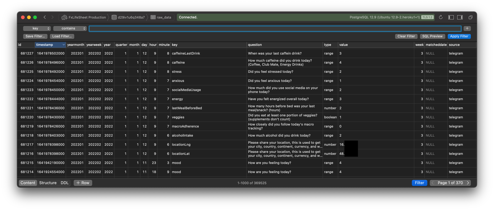

<b>◦ Data Inputs</b>

Multiple times a day, I manually answer questions [FxLifeSheet](https://github.com/KrauseFx/FxLifeSheet) sends me via a Telegram bot.

<b>◦ Data Visualizations</b>

After having tried various tools available to visualize, I ended up writing my own data analysis layer using Ruby, JavaScript together with [Plotly](https://plotly.com/javascript/).

  
    
    
    

    

      <h3>Flying Stats - General</h3>
      

        All flights taken within the last 7 years, tracked using Foursquare Swarm, analyzed by <a href='https://www.jetlovers.com/' target='_blank'>JetLovers</a>.
      

      <ul>
        
          <li>This clearly shows the impact of COVID starting 2020</li>
        
          <li>Sunday has been my "commute" day, flying between San Francisco, New York City and Vienna</li>
        
      </ul>

      
        
          Sources: 
        
        JetLovers, Swarm
      

      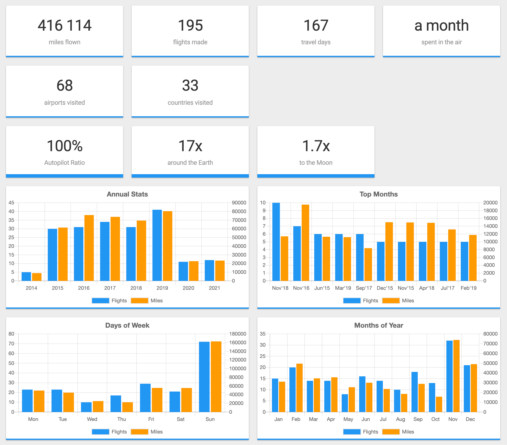

      7 years of data - Last updated on 2021-12-12
    

  
    
    
    

    

      <h3>Flying Stats - Top</h3>
      

        All flights taken within the last 7 years, tracked using Foursquare Swarm, analyzed by <a href='https://www.jetlovers.com/' target='_blank'>JetLovers</a>.
      

      <ul>
        
          <li>Frankfurt - Vienna was the flight connecting me with most US airports</li>
        
          <li>Germany is high up on the list due to layovers, even though I didn't spend time there</li>
        
      </ul>

      
        
          Sources: 
        
        JetLovers, Swarm
      

      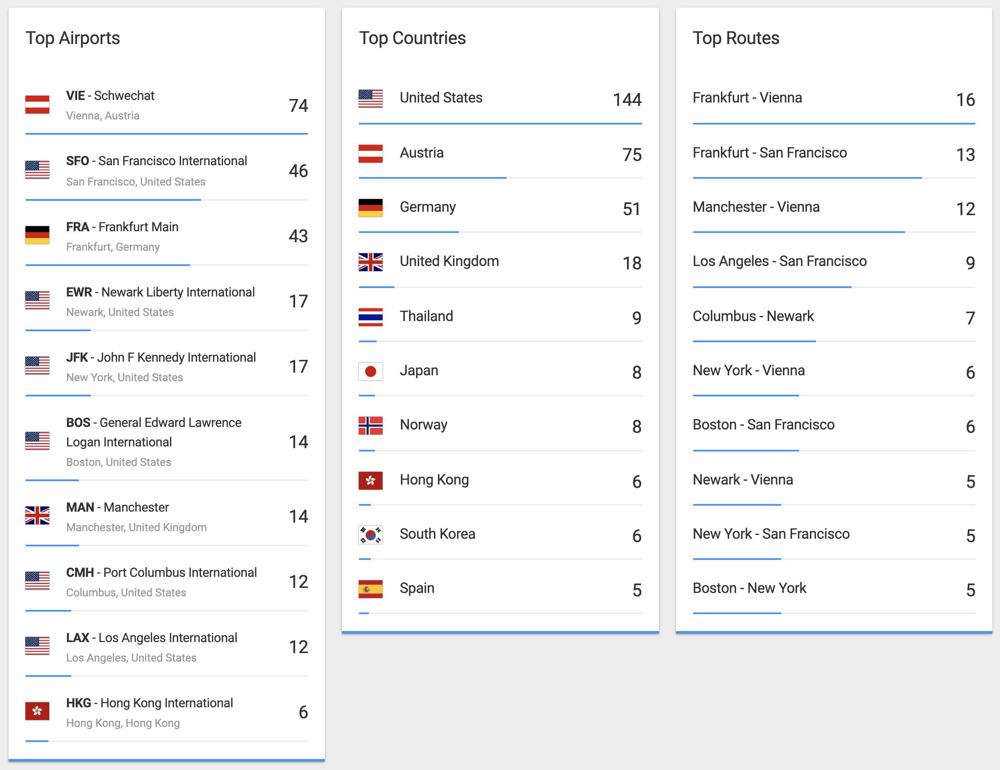

      7 years of data - Last updated on 2021-12-12
    

  
    
    
    

    

      <h3>My life in weeks</h3>
      

        Inspired by Your Life in Weeks by WaitButWhy, I use Google Sheets to visualize every week of my life, with little notes on what city/country I was at, and other life events that have happened.
      

      <ul>
        
          <li>The first 14 years I didn't really get done much</li>
        
          <li>Taking a few weeks (or even months) off between jobs (if you have the possibility) is one of the best decisions I've made</li>
        
          <li>Yellow area indicates no active full-time employment</li>
        
          <li>Shades of blue indicate my full-time employments</li>
        
          <li>Shades of red is formal education</li>
        
      </ul>

      
        
          Sources: 
        
        Manually
      

      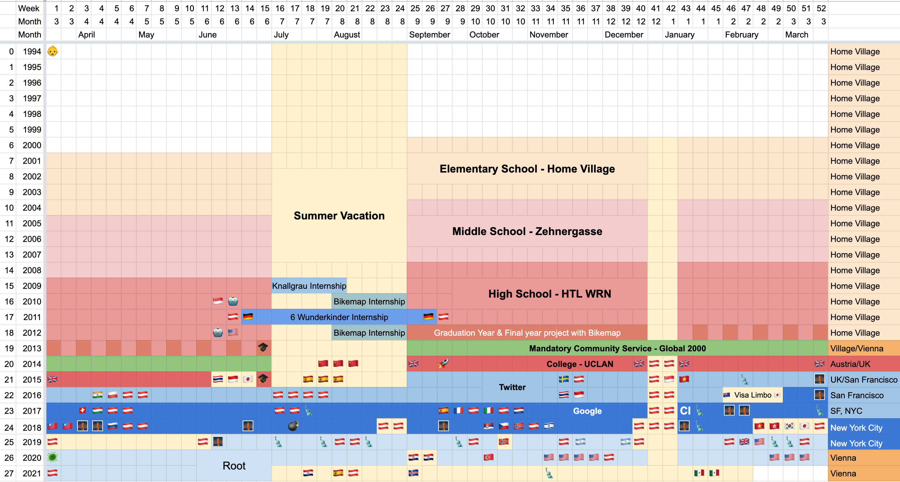

      27.5 years of data - Last updated on 2022-02-24
    

  
    
    
    

    

      <h3>Top Cities (Checkins)</h3>
      

        Each time I checked-into a place (e.g. Coffee, Restaurant, Airport, Gym) at a given city, this is tracked as a single entry
      

      <ul>
        
      </ul>

      
        
          Sources: 
        
        Swarm
      

      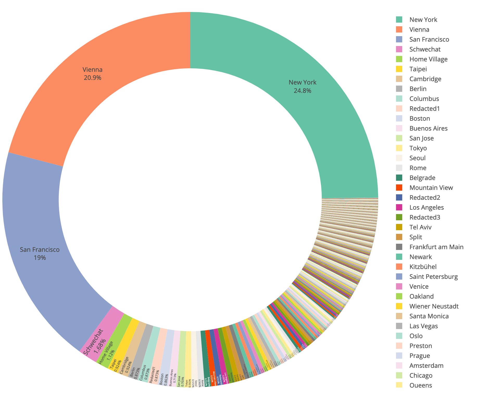

      7 years of data - Last updated on 2021-12-12
    

  
    
    
    

    

      <h3>Top Cities over the years</h3>
      

        Each check-in at a given city is counted as a single entry, grouped by years
      

      <ul>
        
          <li>2016 and 2017 I lived in San Francisco</li>
        
          <li>2018 and 2019 I lived in New York City</li>
        
          <li>2020 and 2021 I lived in Vienna</li>
        
          <li>The longer it's been since I moved away from Austria, the more time I actually spent back home in Austria for visits and vacations</li>
        
          <li>2020 clearly shows the impact of COVID</li>
        
      </ul>

      
        
          Sources: 
        
        Swarm
      

      

      7 years of data - Last updated on 2021-12-12
    

  
    
    
    

    

      <h3>Top Categories of Checkins</h3>
      

        Each check-in at a given category is tracked, and summed up over the last years
      

      <ul>
        
          <li>In 2020 and 2021, check-ins at Offices went down to zero due to COVID, and a distributed work setup</li>
        
      </ul>

      
        
          Sources: 
        
        Swarm
      

      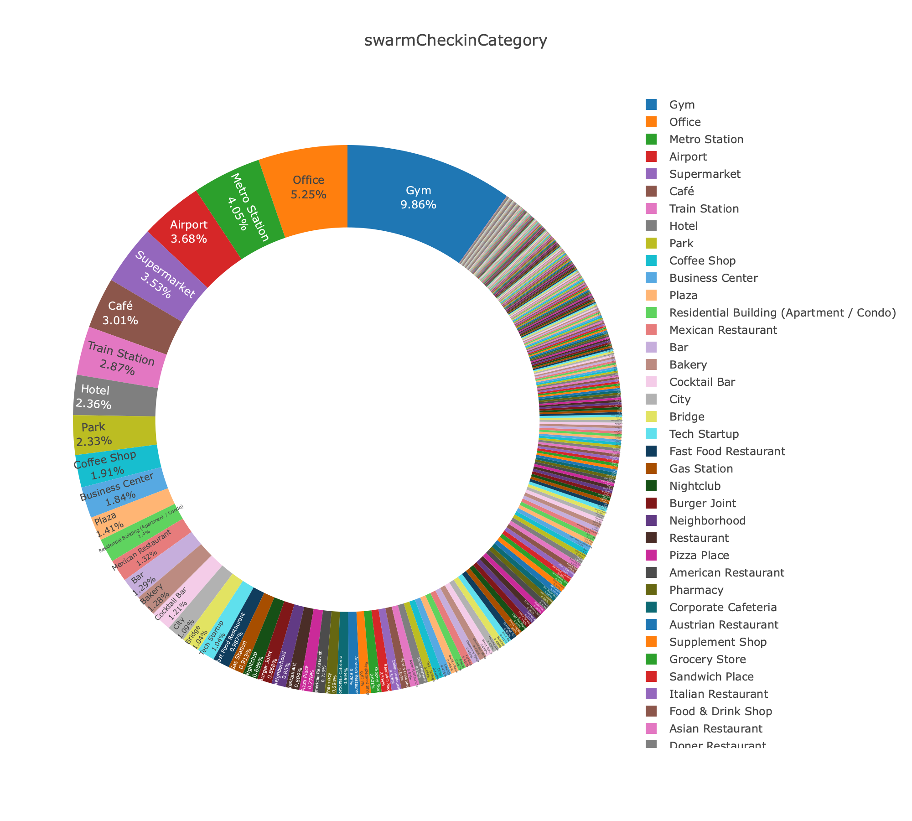

      7 years of data - Last updated on 2021-12-12
    

  
    
    
    

    

      <h3>Maximal temperature each day of the year</h3>
      

        Historic weather data based on the location I was at on that day based on my Swarm check-ins. Days with no data are rendered as white
      

      <ul>
        
          <li>Days in Summer are warmer than days in Winter</li>
        
          <li>Summer 2019 I spent in New York City, while 2020 and 2021 I spent in Vienna. The graph shows the summer in NYC to reach higher temperatures</li>
        
          <li>Week 36 in 2021 I spent in Iceland, therefore significantly lower temperatures</li>
        
          <li>End of November in 2019 I spent in Buenos Aires, therefore way higher temperatures</li>
        
          <li>December 2019 I spent in Columbus, Ohio, being the coldest week of the year</li>
        
      </ul>

      
        
          Sources: 
        
        Visual Crossing historic weather data, Swarm
      

      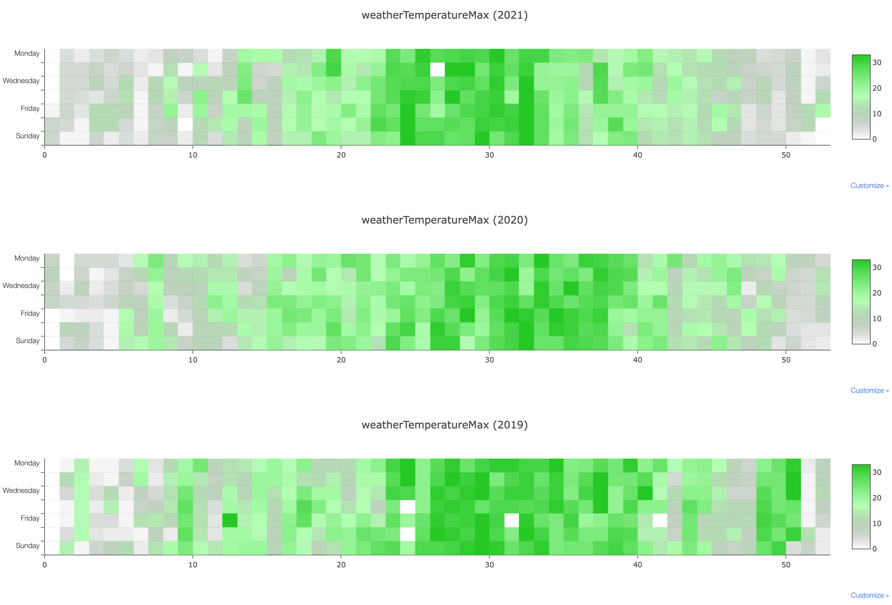

      3 years of data - Last updated on 2022-01-01
    

  
    
    
    

    

      <h3>Location History</h3>
      

        Every Swarm check-in visualized on a map. Only areas where I've had multiple check-ins are rendered.
      

      <ul>
        
      </ul>

      
        
          Sources: 
        
        Swarm
      

      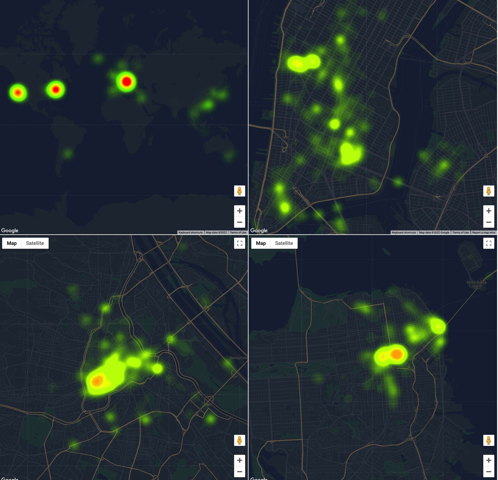

      7 years of data - Last updated on 2022-01-01
    

  
    
    
    

    

      <h3>Location History</h3>
      

        Every Swarm check-in over the last 7 years visualized on a map, including the actual trip (flight, drive, etc.)
      

      <ul>
        
      </ul>

      
        
          Sources: 
        
        Swarm
      

      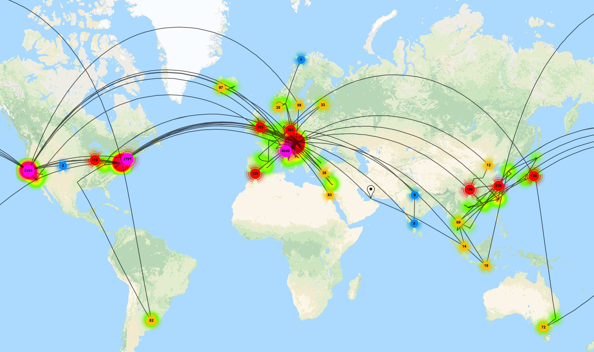

      7 years of data - Last updated on 2022-01-01
    

  
    
    
    

    

      <h3>Location History - Cities</h3>
      

        Every Swarm check-in over the last 7 years visualized, zoomed in
      

      <ul>
        
      </ul>

      
        
          Sources: 
        
        Swarm
      

      

      7 years of data - Last updated on 2022-01-01
    

  
    
    
    

    

      <h3>Happy Days</h3>
      

        Bucketing all days, by the days at which I was above average happy (excited, pumped). On days where I was happy:
      

      <ul>
        
          <li>50% more likely to have pushed my comfort zone</li>
        
          <li>45% more likely to have medidated that day</li>
        
          <li>40% more likely to feel good about the current direction in life, and working towards it</li>
        
          <li>15% warmer than the average</li>
        
          <li>15% less time on social media</li>
        
          <li>30% less time spent watching TV</li>
        
      </ul>

      
        
          Sources: 
        
        Manually
      

      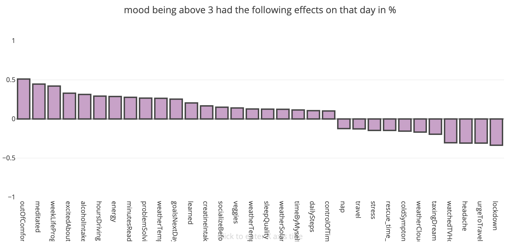

      2.5 years of data - Last updated on 2022-01-01
    

  
    
    
    

    

      <h3>Average daily steps over time</h3>
      

        Measured through the iPhone's Health app, which stayed the same over the last 8 years, while my smart watches have changed over time
      

      <ul>
        
          <li>I walk more than twice as much when I'm in New York City, compared to any other city</li>
        
          <li>In NYC I had the general rule of thumb to walk instead of taking public transit whenever it's less than 40 minutes. I used that time to call friends & family, or listen to audio books</li>
        
          <li>Vienna is very walkable, however also has excellent public transit with subway trains coming every 3-5 minutes causing me to walk less</li>
        
          <li>San Francisco was always scary to walk</li>
        
      </ul>

      
        
          Sources: 
        
        Apple Health
      

      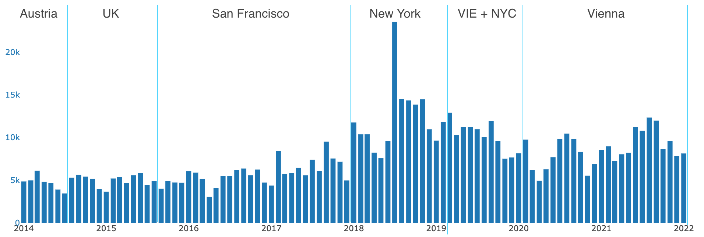

      8 years of data - Last updated on 2022-01-01
    

  
    
    
    

    

      <h3>Number of Swarm checkins over time</h3>
      

        Number of Swarm checkins on each quarter over the last 10 years. I didn't use Foursquare Swarm as seriously before 2015. Once I moved to San Francisco in Q3 2015 I started my habit of checking into every POI I visit
      

      <ul>
        
          <li>Q3 2015 I moved to San Francisco, however I couldn't check-in yet, since my move was a secret until the official announced at the Twitter Flight conference</li>
        
          <li>Q2 2020 clearly shows the impact of COVID with Q3 already being open in Austria</li>
        
          <li>Q3 2021 the vaccine was already widely available and I was able to travel/visit more again</li>
        
          <li>My time in New York was the most active when it comes to check-ins. When I'm in NYC, I tend to eat/drink out more, and grab to-go food, which I do way less in Vienna</li>
        
      </ul>

      
        
          Sources: 
        
        Swarm
      

      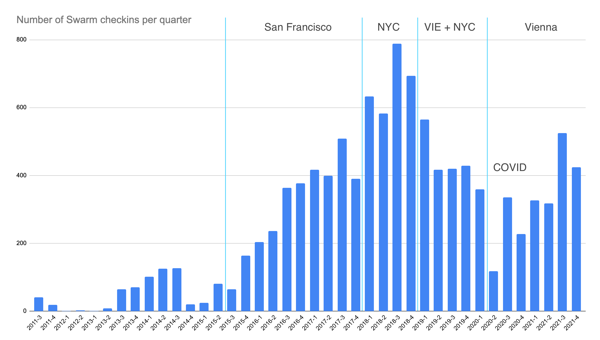

      10 years of data - Last updated on 2022-01-01
    

  
    
    
    

    

      <h3>Days in full lockdown</h3>
      

        Number of days per year that I've spent in full lockdown, meaning closed restaurants, bars and non-essential stores.
      

      <ul>
        
          <li>Parts of the Austrian lockdown I've spent already vaccinated in the US</li>
        
          <li>2021 I spent more days in a full lockdown than in 2020, even with vaccines available</li>
        
      </ul>

      
        
          Sources: 
        
        Manually
      

      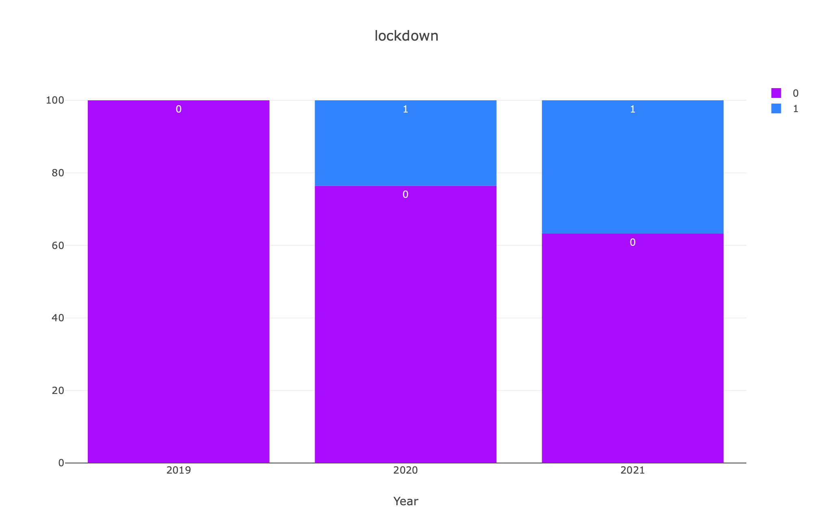

      3 years of data - Last updated on 2022-01-01
    

  
    
    
    

    

      <h3>Correlation between weight and resting heart rate</h3>
      

        This graph clearly shows the correlation between my body weight, and my sleeping/resting heart rate. The resting heart rate is measured by the <a href='https://www.withings.com/us/en/scanwatch' target='_blank'>Withings Scanwatch</a> while sleeping, and basically indicates how hard your heart has to work while not being active. Generally the lower the resting heart rate, the better.
      

      <ul>
        
          <li>I started my lean bulk (controlled weight gain combined with 5 workouts a week) in August 2020</li>
        
          <li>The resting rate rate grew from 58bpm to 67bpm from August 2020 to March 2021 (~8 months) with a weight gain of 8.5kg (19lbs)</li>
        
          <li>The spike in resting heart rate in July, August 2020 was due to bars and nightclubs opening up again in Austria</li>
        
          <li>After a night of drinking, my sleeping heart rate is about 50% - 75% higher than after a night without any alcohol</li>
        
          <li>The spike in resting heart rate in October/November/December 2021 was due to having bronchitis and a cold/flu, not getting correct treatment early enough</li>
        
      </ul>

      
        
          Sources: 
        
        Withings Scanwatch, Withings Scale
      

      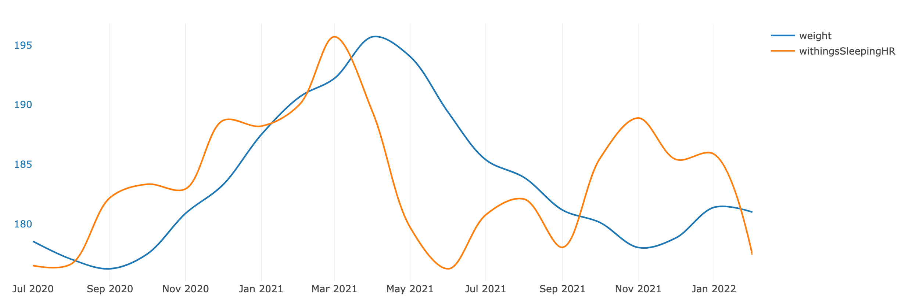

      1.5 years of data - Last updated on 2022-02-09
    

  
    
    
    

    

      <h3>Weather conditions per year</h3>
      

        Historic weather data based on the location I was at on that day based on my Swarm check-ins.
      

      <ul>
        
          <li>2019 I experienced more cloudy weather than the following years</li>
        
      </ul>

      
        
          Sources: 
        
        Visual Crossing historic weather data, Swarm
      

      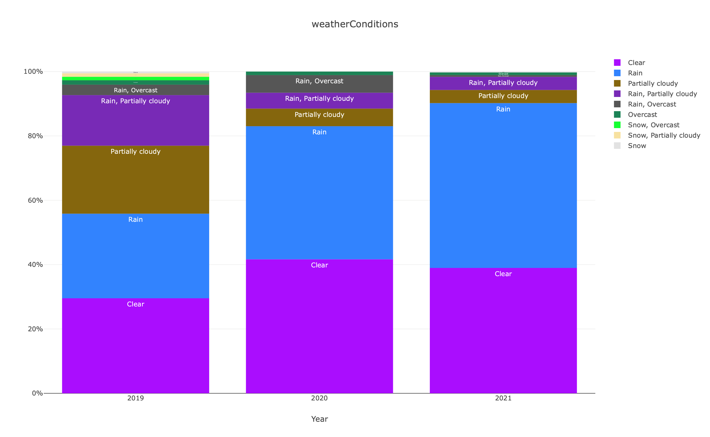

      3 years of data - Last updated on 2022-01-01
    

  
    
    
    

    

      <h3>Alcoholic Beverages per day</h3>
      

        Alcohol drinks per day. Days with no data are rendered as white
      

      <ul>
        
          <li>Unless there are social obligations, or there is a party, I usually drink 0 alcoholic drinks</li>
        
          <li>Friday and Saturday nights are clearly visible on those graphs</li>
        
          <li>2021 and summer/winter of 2019 also show the Wednesday night party in Vienna</li>
        
          <li>Q2 and Q4 2020 clearly show the COVID lockdowns, as well as Q2 2021</li>
        
          <li>Summer of 2021 all bars and dance clubs were open in Vienna</li>
        
      </ul>

      
        
          Sources: 
        
        Manually
      

      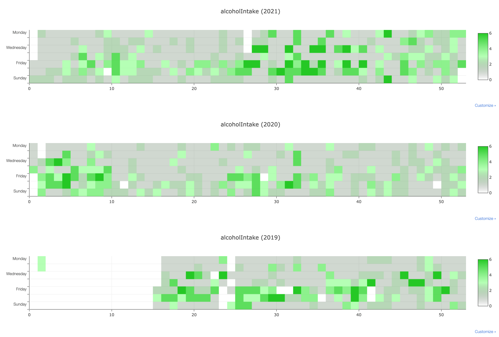

      2.5 years of data - Last updated on 2022-01-01
    

  
    
    
    

    

      <h3>Workouts in the gym</h3>
      

        Each green square represents a strength-workout in the gym, I try my best to purchase day passes at gyms while traveling
      

      <ul>
        
          <li>During the first lockdown in Q2 2020 I didn't have access to a gym, and didn't track home-workouts</li>
        
          <li>In 2021 I tend to work out less often on Sunday, the day I visit my family's place</li>
        
          <li>In Q4 2021 I had a cold for a longer time</li>
        
          <li>I went from ~50 workouts per year in 2014/2015 to ~200 per year in 2018 - 2021</li>
        
      </ul>

      
        
          Sources: 
        
        Manually
      

      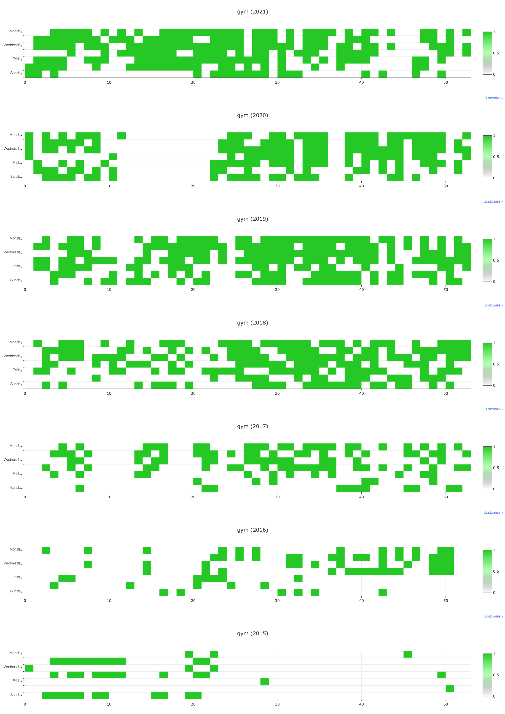

      7 years of data - Last updated on 2022-01-01
    

  
    
    
    

    

      <h3>Living Style</h3>
      

        From late 2017 to early 2020 I lived without a permanent home address as a <a href='/blog/one-year-nomad' target='_blank'>digital nomad</a>, staying at various Airbnbs or taking over a few weeks of a lease from a friend
      

      <ul>
        
      </ul>

      
        
          Sources: 
        
        Manually
      

      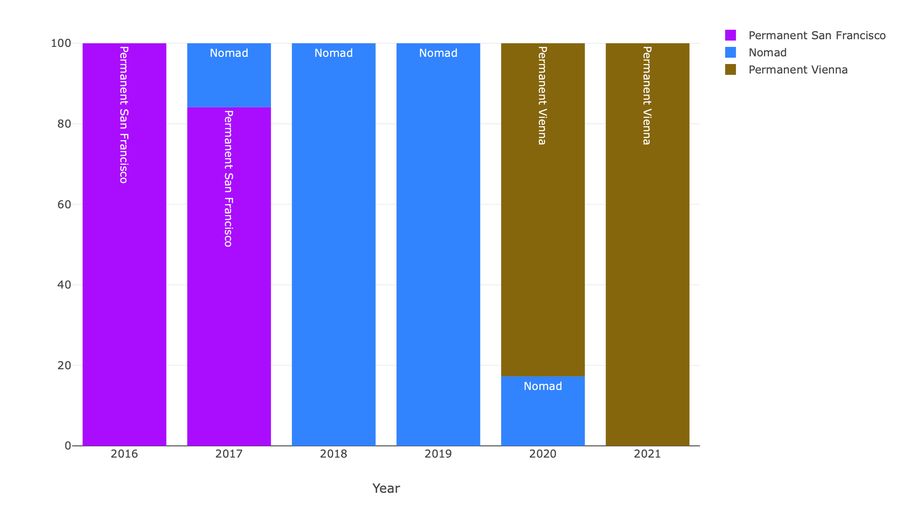

      7 years of data - Last updated on 2022-01-01
    

  
    
    
    

    

      <h3>How does high temperature affect my life?</h3>
      

        On days with a maximum temperature of more than 26 Celsius (78.8 Fahrenheit), the following other factors were affected
      

      <ul>
        
          <li>80% more likely to take a freezing cold shower</li>
        
          <li>37% more likely to hit the gym</li>
        
          <li>26% more daily steps</li>
        
          <li>20% more alcoholic beverages</li>
        
          <li>15% more likely to go out in the evening</li>
        
          <li>13% less likely to take a nap</li>
        
          <li>20% less time in a code editor</li>
        
          <li>21% less likely to be sick</li>
        
          <li>Generally lower stress/anxiety levels</li>
        
          <li>100% less likely to be in a COVID related lockdown</li>
        
      </ul>

      
        
          Sources: 
        
        Visual Crossing historic weather data, Manually
      

      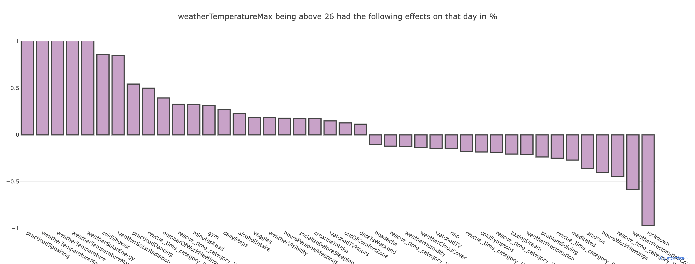

      2.5 years of data - Last updated on 2022-01-01
    

  
    
    
    

    

      <h3>How healthy was I over the years?</h3>
      

        Every day I answered the question on how healthy I feel, whereas the yellow color indicates that I felt a little under the weather, not sick per-se. Red means I was sick and had to stay home. Green means I felt energized and healthy
      

      <ul>
        
          <li>During the COVID lockdowns I tend to stay healthier</li>
        
          <li>Usually during excessive traveling I get sick (cold/flu)</li>
        
          <li>Q4 2021 I had bronchitis, however didn't know about it at the time and didn't get proper treatment</li>
        
          <li>Overall I'm quite prone to getting sick (cold/flu)</li>
        
      </ul>

      
        
          Sources: 
        
        Manually
      

      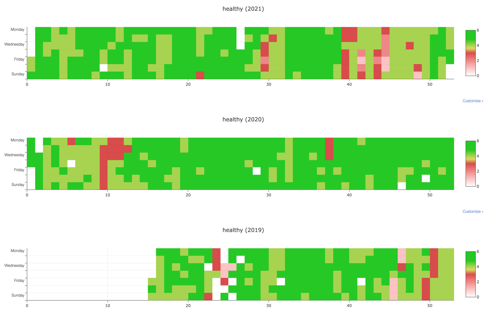

      2.5 years of data - Last updated on 2022-01-01
    

  
    
    
    

    

      <h3>How does longer sleep duration affect my day?</h3>
      

        On days where I had a total sleep duration of more than 8.5 hours, the following other factors were affected
      

      <ul>
        
          <li>65% more likely to have cold symptons</li>
        
          <li>60% more likely to have headache</li>
        
          <li>40% more social media usage</li>
        
          <li>30% more likely to be a rainy day</li>
        
          <li>20% more likely to be a weekend</li>
        
          <li>15% more likely to have bad/stressful dreams</li>
        
          <li>12% colder weather on average</li>
        
          <li>20% less likely to hit the gym that day</li>
        
          <li>24% less energy</li>
        
          <li>Overall, it's clear that days with a longer sleep duration tend to be significantly worse days. This is most likely due to the fact that I try to sleep a maximum of 8 hours, and if I actually sleep more than usually because I'm not feeling too well, or even sick</li>
        
      </ul>

      
        
          Sources: 
        
        Withings Scan Watch, Manually
      

      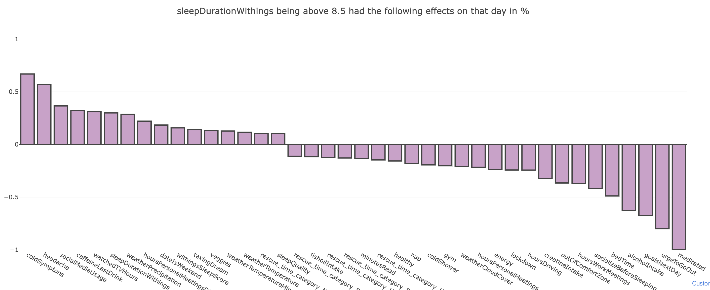

      2.5 years of data - Last updated on 2022-01-01
    

  
    
    
    

    

      <h3>Days with more than 15,000 steps</h3>
      

        On days where I walked more than 15,000 steps (I walked an average of 9200 steps a day the last 3 years)
      

      <ul>
        
          <li>60% more time spent with friends in real-life</li>
        
          <li>50% warmer temperature that day</li>
        
          <li>40% more likely to socialize with friends before going to sleep</li>
        
          <li>35% more likely to be a weekend day</li>
        
          <li>20% less likely to take a nap that day</li>
        
          <li>30% less likely to correctly track my macros (food)</li>
        
          <li>30% less time spent in work calls/meetings</li>
        
          <li>30% less anxious</li>
        
          <li>40% less likely to meditate</li>
        
          <li>40% less time spent writing code</li>
        
          <li>40% less likely to be a rainy day</li>
        
          <li>50% less time spent watching TV</li>
        
          <li>95% less likely to be a day in lockdown</li>
        
      </ul>

      
        
          Sources: 
        
        Apple Health
      

      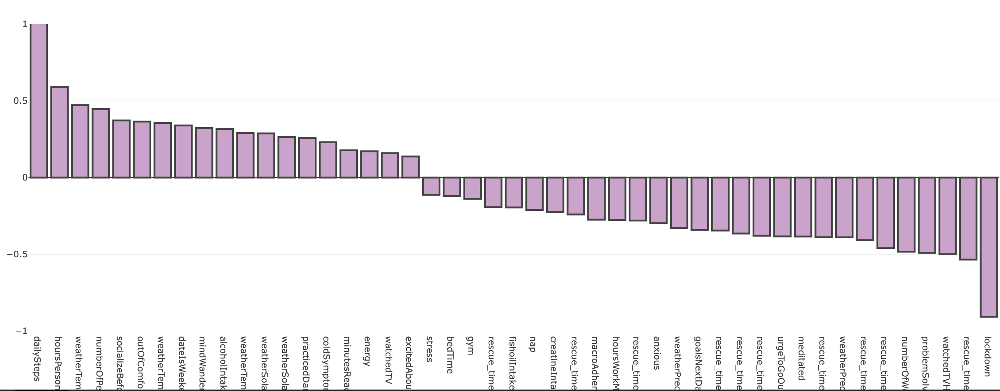

      2.5 years of data - Last updated on 2022-01-01
    

  
    
    
    

    

      <h3>Days where I tracked my mood to be very excited/happy</h3>
      

        On days where I tracked my mood to be very excited/happy, the following other factors were affected
      

      <ul>
        
          <li>Significantly more likely to be a day where I went out of my comfort zone</li>
        
          <li>Significantly more likely to have medidated that day</li>
        
          <li>70% more likely to have taken a freezing cold shower</li>
        
          <li>60% more likely to have worked on interrelated technical challenges</li>
        
          <li>60% more time spent reading or listening to audio books</li>
        
          <li>50% more likely to have learned something new that day</li>
        
          <li>50% more excited about what's ahead in the future</li>
        
          <li>40% more likely to have hit the gym that day</li>
        
          <li>30% more likely to have eaten veggies</li>
        
          <li>25% warmer</li>
        
          <li>20% more computer use</li>
        
          <li>25% less alcoholic beverages</li>
        
          <li>35% less likely to be a weekend</li>
        
      </ul>

      
        
          Sources: 
        
        Manually
      

      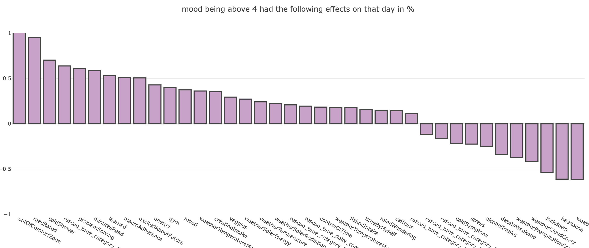

      2.5 years of data - Last updated on 2022-01-01
    

  
    
    
    

    

      <h3>Days with more than 4 alcoholic drinks</h3>
      

        On days where I had more than 4 alcoholic beverages, the following other factors were affected
      

      <ul>
        
          <li>21x more likely to dance</li>
        
          <li>80% more likely to take a nap</li>
        
          <li>60% more time spent with friends</li>
        
          <li>40% warmer</li>
        
          <li>25% more steps</li>
        
          <li>10% higher sleeping heart rate that night</li>
        
      </ul>

      
        
          Sources: 
        
        Manually
      

      

      2.5 years of data - Last updated on 2022-01-01
    

  
    
    
    

    

      <h3>Weight history of 8 years</h3>
      

        Historic weight, clearly showing the various bulks and cuts I've made over the years. Only the last 5 years are rendered in this graph, with the last 3 years having tracked my weight way more frequently.
      

      <ul>
        
          <li>Lowest recorded weight was 69kg/152lbs in 2014 (age 20)</li>
        
          <li>Highest recorded weight was 89.8kg/198lbs in 2021 (age 27)</li>
        
          <li>Meaning, on the same height of 193cm (6"4), I gained 20kg (44lbs) while staying under 12% body fat</li>
        
      </ul>

      
        
          Sources: 
        
        Withings Scale
      

      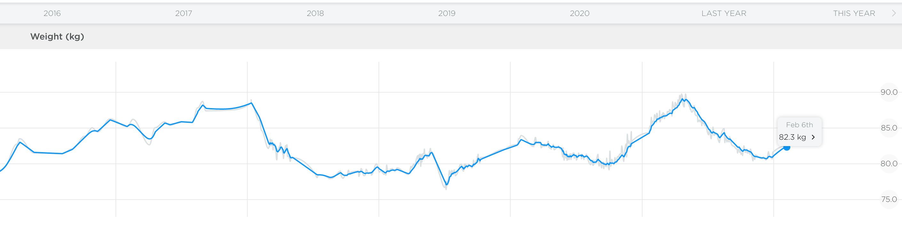

      9 years of data - Last updated on 2022-02-17
    

  
    
    
    

    

      <h3>Food tracking - Macros</h3>
      

        On weeks where I have a routine (not traveling), I track most my meals. Whenever I scale my food, I try to guess the weight before to become better at estimating portion sizes.
      

      <ul>
        
          <li>Tracking macros precisely is the best way to lose/gain weight at a controlled and healthy speed</li>
        
          <li>When I first started tracking macros, additionally to already working out regularly, is when I saw by far the best results</li>
        
          <li>It takes a lot of energy to be consistent, but it's worth it, and it will make you feel good (e.g. feeling good about using a spoon to eat plain Nutella if you have the macros left)</li>
        
          <li>Gaining and losing weight is pretty much math, if you track your macros and weight, and you have almost full control over it</li>
        
      </ul>

      
        
          Sources: 
        
        MyFitnessPal
      

      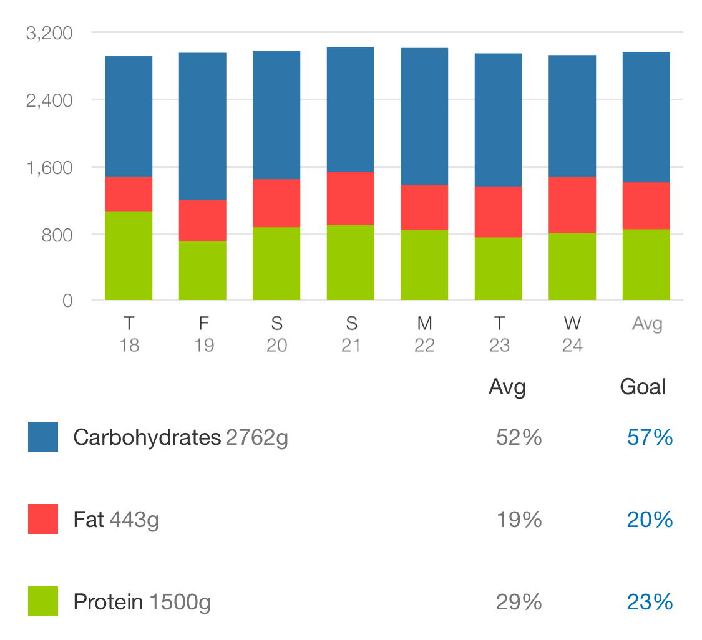

      4 years of data - Last updated on 2022-02-17
    

  
    
    
    

    

      <h3>Bulk & Cut Phase visualized</h3>
      

        I usually have slow bulk & cut phases, where I gain and lose weight at a controlled speed, combined with tracking my meals.
      

      <ul>
        
          <li>I only track my weight if I didn't drink alcohol the night before, and after getting a full night's sleep, since otherwise the weight fluctuates a lot</li>
        
          <li>Generally, you can pretty much calculate your weight on a certain date, if you consistently track your meals, and correctly calculated your macros</li>
        
      </ul>

      
        
          Sources: 
        
        Withings Scale, weightgrapher.com
      

      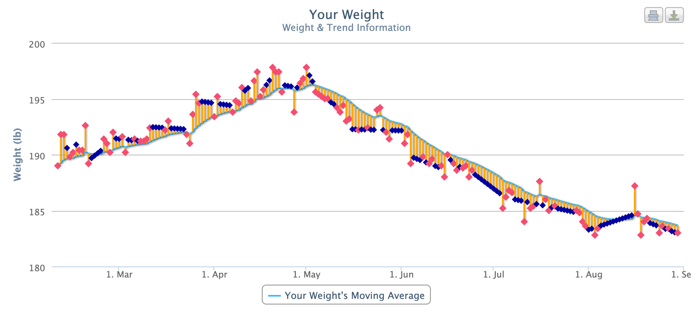

      1 years of data - Last updated on 2022-01-01
    

  
    
    
    

    

      <h3>Air Quality in various rooms</h3>
      

        I used the <a href='https://www.getawair.com/products/element' target='_blank'>Awair Element</a> at home in Vienna, in every room over multiple days
      

      <ul>
        
          <li>Overall, the air quality in Vienna is excellent. Just opening the windows for a few minutes is enough to get a 100% air score</li>
        
          <li>The smaller the room, the more difficult it is to keep the CO2 levels low</li>
        
          <li>The only room where I'm still struggling to keep the CO2 levels low is my bedroom, which is small, and doesn't offer any ventilation. Keeping the doors open mostly solves the high CO2 levels, however comes with other downsides like more light</li>
        
          <li>Probably obvious for many, but I didn't realize ACs don't transport any air into the room, but just moves it around</li>
        
          <li>Opening the windows for a longer time in winter will cause low humidity and low temperatures, so it's often not a good option</li>
        
          <li>I didn't learn anything meaningful from the 'Chemicals' and 'PM2.5' graphs</li>
        
      </ul>

      
        
          Sources: 
        
        Awair
      

      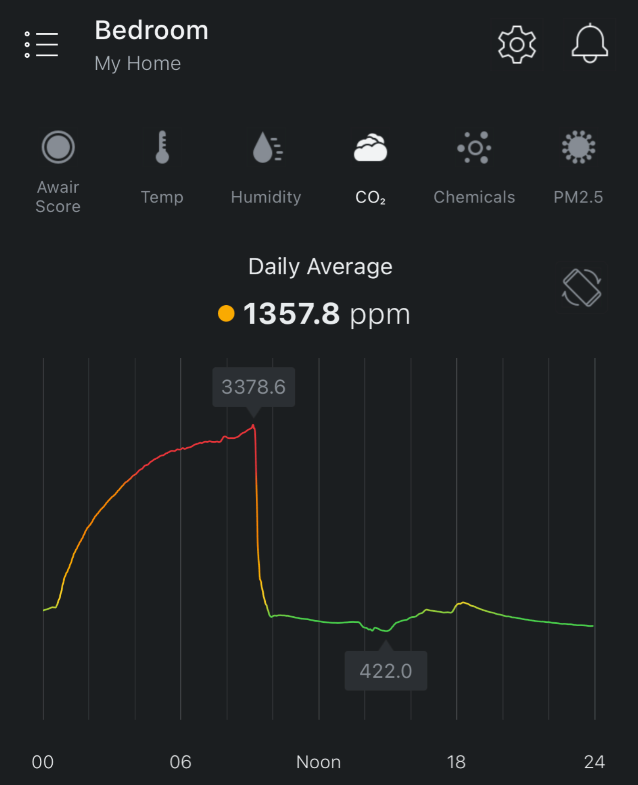

      1 years of data - Last updated on 2022-02-09
    

  
    
    
    

    

      <h3>Investment Distribution</h3>
      

        Every second week I track my current investments and cash positions. As part of this project, it tells me how to most efficiently re-balance my investments when they're off, while also minimizing the occuring fees
      

      <ul>
        
          <li>I have a burndown chart, which visualizes how my networth would grow/drop over time in various scenarios</li>
        
          <li>I have a graph that ensures I have the right target distribution of high, medium and low risk positions</li>
        
          <li>Whenever I take on a potential new project/role, I simulate the various outcome scenarios over the next few years</li>
        
          <li>For obvious reasons, I can't include more of the graphs and simulations I have available</li>
        
      </ul>

      
        
          Sources: 
        
        Manually
      

      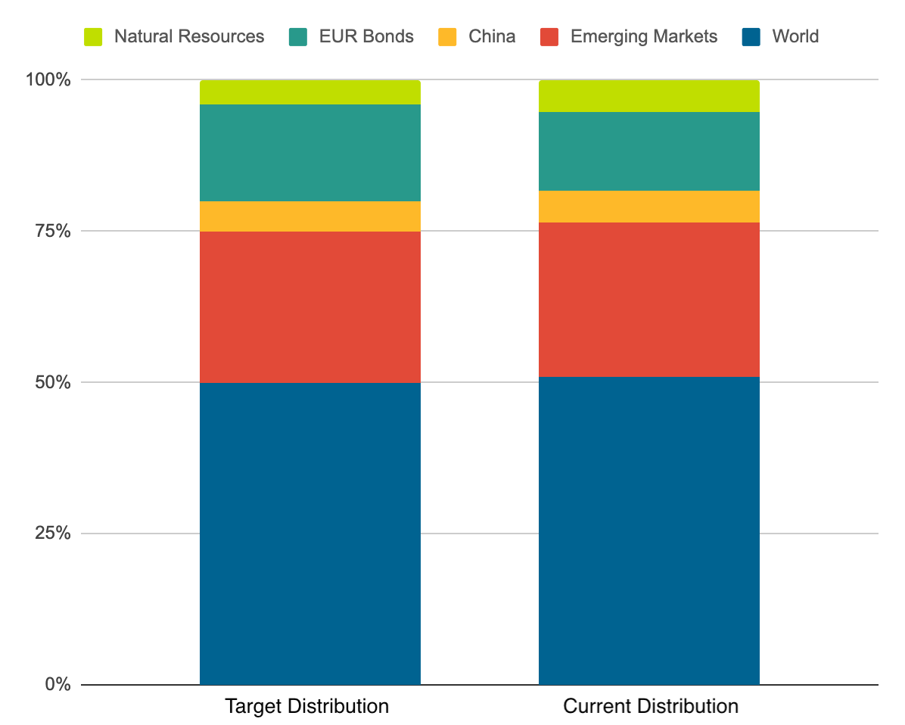

      8 years of data - Last updated on 2022-02-09
    

  
    
    
    

    

      <h3>Annual money flow</h3>
      

        Inspired by the Reddit commnunity <a href='https://old.reddit.com/r/PFPorn' target='_blank'>/r/PFPorn</a>, I create an annual money flow chart to clearly see how much money I earn, where I'm spending it, and how much I'm saving. The chart below isn't mine (for privacy reasons), but just an example I created.
      

      <ul>
        
          <li>Not owning an apartment, and [living in Airbnbs as a nomad](/blog/one-year-nomad) I actually spent less money. This was due to not having to buy any furniture, appliances, etc. but also because the number of items I could by for myself was limited, as everything was limited to be able to fit into 2 suitcases.</li>
        
          <li>Misc. subscriptions/expenses are adding up quickly</li>
        
          <li>Having an End-Of-Year summary from your credit card provider, and always using your card when possible, is a great way to get those numbers</li>
        
          <li>Creating this chart is still a lot of work, if you want to also consider getting reimbursed, or expenses you've covered for a group (e.g. booked a larger Airbnb)</li>
        
      </ul>

      
        
          Sources: 
        
        Chase Credit Card Year Summary, sankeymatic.com, Manually
      

      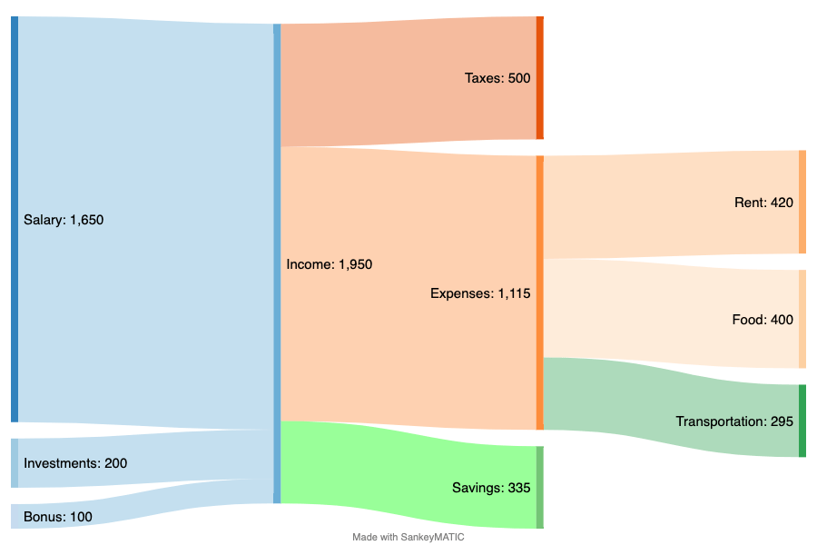

      5 years of data - Last updated on 2022-02-09
    

  
    
    
    

    

      <h3>Rescue Time Computer Usage Categories</h3>
      

        Using RescueTime, I tracked my exact computer usage, and the categories of activities in which I spend time with.
      

      <ul>
        
          <li>Over the last 7 years, I went from spending around 10% of my time with communication & scheduling, to around 30%</li>
        
          <li>Over the last 7 years, I went from spending around 33% of my time with software development, to less than 10% (now that I'm not currently full-time employed)</li>
        
          <li>All other categories stayed pretty much on the same ratio over the last 7 years</li>
        
      </ul>

      
        
          Sources: 
        
        RescueTime
      

      

      7 years of data - Last updated on 2022-01-01
    

  
    
    
    

    

      <h3>How does Winter affect my life?</h3>
      

        Winter (being from 21st Dec to 20th March) has the following effects on my life:
      

      <ul>
        
          <li>Online shopping time going up by 100%, most likely due to the last Winters having spent in lockdown</li>
        
          <li>Chances of having cold symptons goes up ~45%</li>
        
          <li>35% less likely to take a freezing cold shower</li>
        
          <li>You can generate significantly less solar energy in Winter :joke:</li>
        
      </ul>

      
        
          Sources: 
        
        Manual
      

      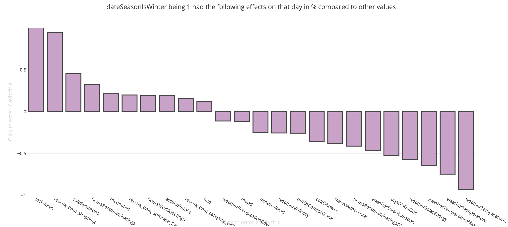

      2.5 years of data - Last updated on 2022-01-01
    

  
    
    
    

    

      <h3>How does Summer affect my life?</h3>
      

        Summer (being from 21st June to 23rd September) has the following effects on my life:
      

      <ul>
        
          <li>Chances of taking a freezing cold shower goes up by 100%</li>
        
          <li>I walk 33% more steps in Summer</li>
        
          <li>30% more likely to hit the gym</li>
        
          <li>23% more alcoholic beverages</li>
        
          <li>20% less time spent reading news & opinions (as per RescueTime classifications)</li>
        
          <li>40% less likely to be sick</li>
        
          <li>40% less time spent on Entertainment on my computer (as per RescueTime classifications)</li>
        
          <li>30% less likely to have bad dreams</li>
        
      </ul>

      
        
          Sources: 
        
        Manual
      

      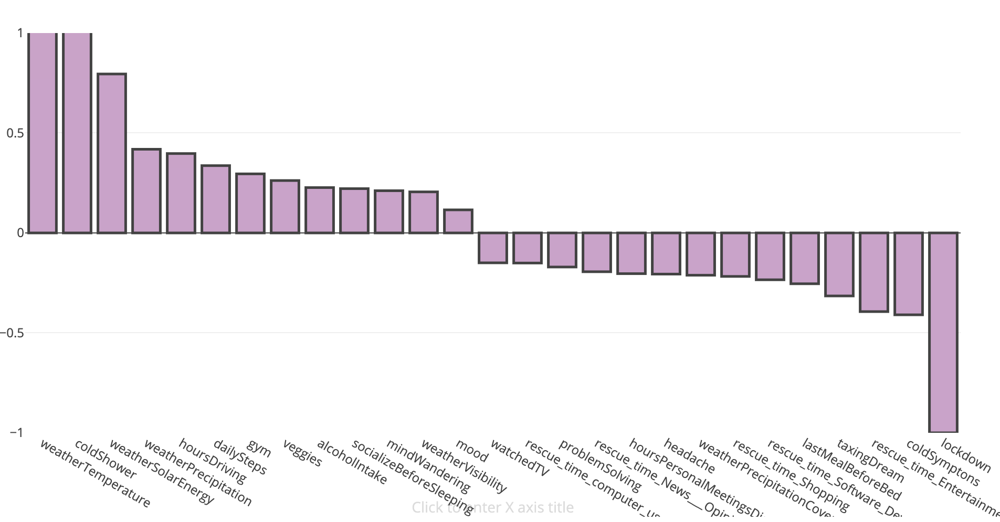

      2.5 years of data - Last updated on 2022-01-01
    

  
    
    
    

    

      <h3>What are weekends like?</h3>
      

        Weekends for me naturally involve less work time, more going out, and social interactions, as well as visiting family memebers outside the city
      

      <ul>
        
          <li>150% more computer time spent on "Entertainment", which is mostly coming from occasionally playing Factorio or Age Of Empires with friends at LAN-Party gatherings</li>
        
          <li>74% more time spent watching TV</li>
        
          <li>60% more time spent with friends IRL</li>
        
          <li>55% more dancing, when going out</li>
        
          <li>45% more likely to have a headache, due to drinking alcohol the night before</li>
        
          <li>25% less gym visits, mostly due to family gatherings and not being in the city</li>
        
          <li>45% less likely to properly track my macros/meals, mostly due to family gatherings and going out</li>
        
      </ul>

      
        
          Sources: 
        
        Manual
      

      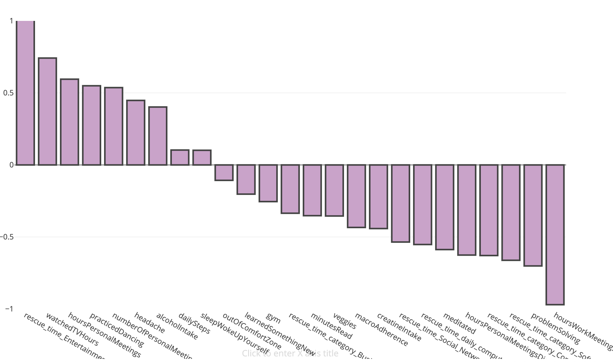

      2.5 years of data - Last updated on 2022-01-01
    

  

  
  

